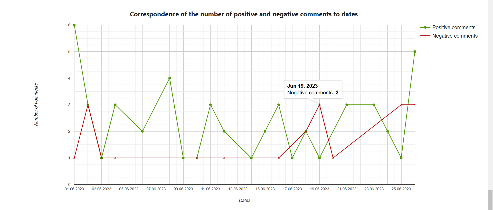

# Sentimeter – сервіс з аналізу настроїв клієнтів до продуктів

## Опис сервісу

Даний сервіс виступає окремим додатком для моніторингу та аналізу настроїв клієнтів у сфері електронної комерції. Для зручності використання сервіс розгортається у Docker контейнері.

## Як під'єнати Sentimeter до власного сервісу з електронної комерції

1. Необхідно мати встановлений Docker;
2. Запустити docker-compose.yml файл, де необхідно вказати мову коментарів та мову dataset для навчання алгоритмів ML, та мови для перекладача:
    - TRAIN_DATA_LANGUAGE=
    - INPUT_COMMENTS_LANGUAGE=
    - LANGUAGES=,
    - LT_LOAD_ONLY=,
3. У разі успішного запуску контейнер з сервісом буде очікувати скрипт для отримання списку коментарів та тренувальний dataset:
    
4. Далі необхідно у директорію /usr/local/bin/ вставити тренувальний dataset файл під назвою train_data.txt із власною предметною областю, дані у якому будуть мати вигляд такий самий як у прикладі у вихідних файлах, де 1 (Позитивний коментар) 0 (Негативний коментар), а також дані речення повинні бути приведені до нижнього регістра та бути лише слова без будь-яких розділових знаків;
5. Також, в цю директорію необхідно вставити скрипт get_data_script.sh який будет зчитувати коментарі із бази даних сервісу з електронної комерції, приклад скрипту наведено у вихідних файлах, необхідно зазначити, що Sentimeter початково працює лише із БД типу PostgreSQL, для роботи із іншими типами БД необхідно вказати у Dockerfile відповідні клієнти ДБ, крім того даний скрипт повинен повертати результат такого типу:
    
6. У разі успішного виконання скрипту для отримання коментарів у терміналі контейнеру сервіса буде вказано наступне:
    
7. Почекати, поки моделі навчаться на тренувальних даних, а також повністю встановиться та почне працювати контейнер із перекладачем;
8. Для зручності тестування сервісу є скрипти run.sh та clear.sh, що допомогають запустити та завершити роботу сервісу;
9. Для повного тестування Sentimeter рекомендую розгорнути мій сервіс з електронної комерції: https://github.com/DmytroNepochatov/Phone-shop в одній мережі Docker.

## Функціонал Sentimeter

Головна сторінка сервісу являє собою список продуктів для яких проводився аналіз настроїв:
    
Крім того є можливість пошуку за назвою продукту.
Також оновлення даних відбувається або вручну за допомогою кнопки у правому верхньому кутку, або самостійно кожні 4 години за допомогою Spring Scheduler.
Якщо перейти в детальну інформацію продукту, то можна побачити графік відповідності кількості коментарів до дат, оцінку товарів від користувачів, а також відсоток позитивних коментарів, що було визначено за допомогою двох алгоритмів: алгоритму максимальної ентропії та наївного алгоритму Байєса:
    
Нижче на сторінці наведено графіки роботи обох алгоритмів, а також класифікацію коментарів на негативні та позитивні:
    
    
    
Після, йде графік відповідності кількості позитивних та негативних коментарів до дат:
    
    