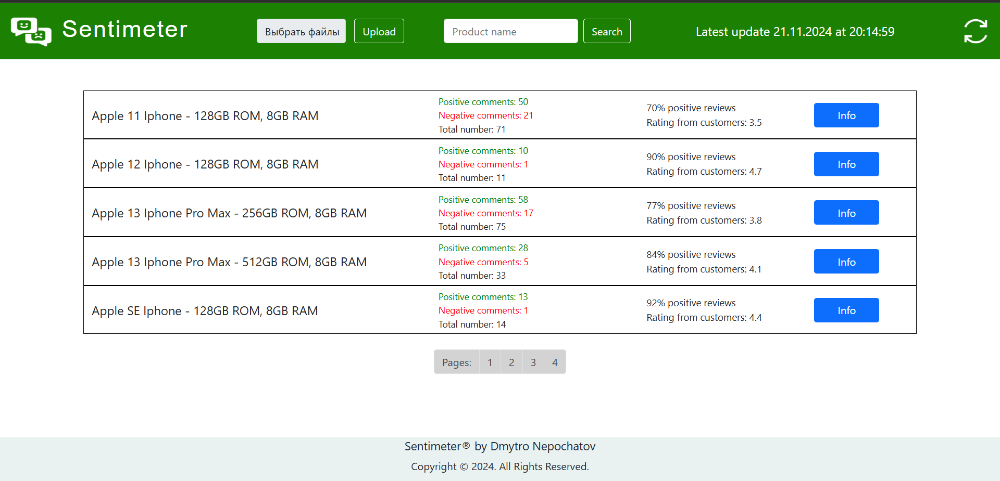

# Sentimeter – service for analyzing customer attitudes towards products

## Service description

This service is a separate application for monitoring and analyzing customer sentiments in the field of e-commerce. For ease of use, the service is deployed in a Docker container.

## How to connect Sentimeter to your own e-commerce service

1. You must have Docker installed;
2. Run the docker-compose.yml file, where you need to specify the comment language and the dataset language for training ML algorithms, and the language for the translator:
    - TRAIN_DATA_LANGUAGE=
    - INPUT_COMMENTS_LANGUAGE=
    - LANGUAGES=
    - LT_LOAD_ONLY= 

   In addition, it is necessary to specify the parameters for the model of the maximum entropy algorithm:
    - CUTOFF=
    - TRAINING_ITERATIONS=

   And for the naive Bayes algorithm model:
    - MIN_SUPPORT=
    - MAX_DF_PERCENT=
    - MAX_NGRAM_SIZE=
3. In case of successful launch, the container with the service will expect a script to get a list of comments and a training dataset:
    
4. Next, it is necessary to insert a training dataset file called train_data.txt with its own subject area into the usrlocalbin directory, the data in which will have the same form as in the example in the source files, where 1 (Positive comment) 0 (Negative comment), as well as sentence data must be lowercase and be only words without any punctuation marks;
5. Also, in this directory it is necessary to insert the script get_data_script.sh which will read comments from the database of the e-commerce service, an example of the script is given in the source files, it should be noted that Sentimeter initially works only with a PostgreSQL database, to work with other types of databases it is necessary specify the appropriate DB clients in the Dockerfile, in addition, this script should return a result of the following type:
    
6. If the script for receiving comments is successfully executed, the following will be indicated in the terminal of the service container:
    
7. Wait until the models are trained on the training data, and the container with the translator is fully installed and running;
8. For the convenience of testing the service, there are run.sh and clear.sh scripts that help start and stop the service;
9. For full testing of Sentimeter, I recommend deploying my e-commerce service: https://github.com/DmytroNepochatov/Phone-shop in the same Docker network.

## Sentimeter functionality

The main page of the service is a list of products for which sentiment analysis was conducted:
    
In addition, it is possible to search by product name.
Also, the data is updated either manually using the button in the upper right corner, or independently every 4 hours using the Spring Scheduler.
If you go to the detailed information of the product, you can see a graph of the correspondence of the number of comments to the dates, the evaluation of products by users, as well as the percentage of positive comments, which was determined using two algorithms: the maximum entropy algorithm and the naive Bayes algorithm:
    
Below on the page, you can choose an algorithm, after choosing which the page will display a graph of positive and negative reviews, as well as their lists:
    
    
    
After that, there is a schedule of correspondence of the number of positive and negative comments to the dates:
    
    