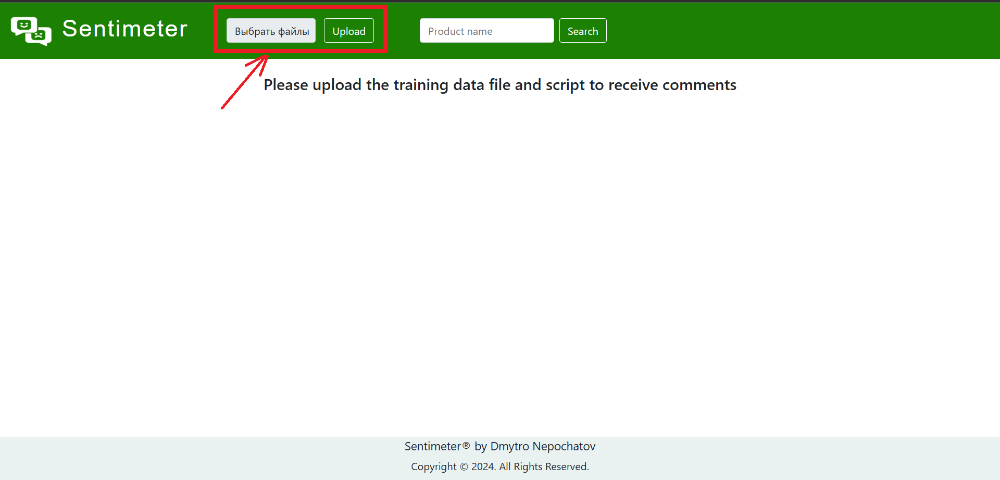
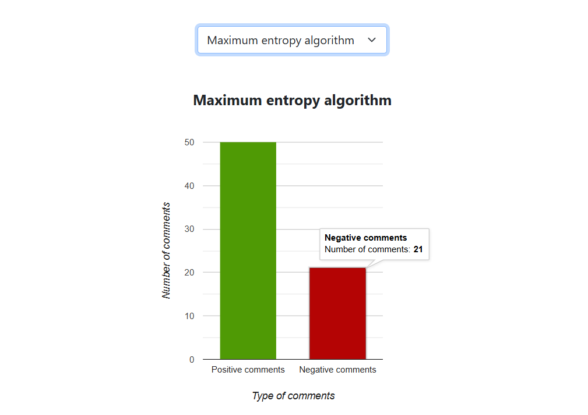
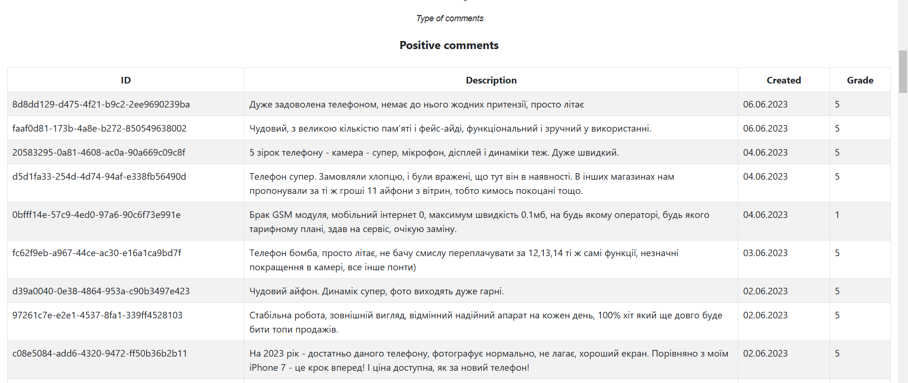

# Sentimeter – service for analyzing customer attitudes towards products

## Service description

This service is a separate application for monitoring and analyzing customer sentiments in the field of e-commerce. For ease of use, the service is deployed in a Docker container.

## How to connect Sentimeter to your own e-commerce service

1. You must have Docker installed;
2. Run the docker-compose.yml file, where you need to specify the comment language and the dataset language for training ML algorithms, and the language for the translator:
    - TRAIN_DATA_LANGUAGE=
    - INPUT_COMMENTS_LANGUAGE=
    - LANGUAGES=
    - LT_LOAD_ONLY= 

   In addition, it is necessary to specify the parameters for the model of the maximum entropy algorithm:
    - CUTOFF=
    - TRAINING_ITERATIONS=

   And for the naive Bayes algorithm model:
    - MIN_SUPPORT=
    - MAX_DF_PERCENT=
    - MAX_NGRAM_SIZE=
3. Next, it is necessary to create a training dataset file called train_data.txt, the data in which will have the same form as in the example in the source files, where 1 (Positive comment) 0 (Negative comment), as well as sentence data must be lowercase and be only words without any punctuation marks;
4. Then you need to create a script called get_data_script.sh to obtain data in accordance with the data contract:
   
   | Field name   | Description                                          | Data type     | Restrictions                 |
   |--------------|------------------------------------------------------|---------------|------------------------------|
   | id           | The unique identifier of the comment                 | INTEGER, TEXT | Cannot be null               |
   | product_name | The name of the product to which the review was made | TEXT          | Cannot be null               |
   | text         | The text of the review                               | TEXT          | Cannot be null               |
   | created      | The date and time the review was created             | TIMESTAMP     | Cannot be null               |
   | grade        | Product evaluation                                   | INTEGER       | If there is no value, then 0 |

   In addition, the received data must be in CSV format with a regular separator and without column names

5. For the convenience of testing the service, there are run.sh and clear.sh scripts that help start and stop the service;
6. For full testing of Sentimeter, I recommend deploying my e-commerce service: https://github.com/DmytroNepochatov/Phone-shop in the same Docker network.

## Sentimeter functionality

First you need to upload the files train_data.txt and get_data_script.sh using the Upload button:
    
If the files are successfully uploaded, the system will inform you that the analysis process is in progress and you need to wait:
    
After completing model training and analysis the main page of the service is a list of products for which sentiment analysis was conducted:
    
In addition, it is possible to search by product name.
Also, the data is updated either manually using the button in the upper right corner, or independently every 4 hours using the Spring Scheduler.
If you go to the detailed information of the product, you can see a graph of the correspondence of the number of comments to the dates, the evaluation of products by users, as well as the percentage of positive comments, which was determined using two algorithms: the maximum entropy algorithm and the naive Bayes algorithm:
    
Below on the page, you can choose an algorithm, after choosing which the page will display a graph of positive and negative reviews, as well as their lists:
    
    
    
After that, there is a schedule of correspondence of the number of positive and negative comments to the dates:
    
    